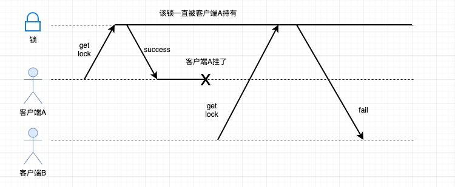
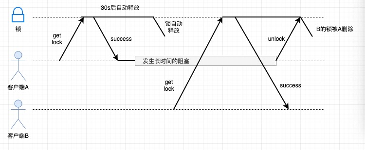

基于Redis的分布式锁
===

该项目是在学习Redis过程中对Redis分布式锁的记录

前言
---
分布式系统中有个备受关注的*互斥性问题*，用通俗的话讲，就是对共享资源的抢占问题（可以想象多个用户抢占数量有限的红包），
如果不同的请求对同一个或者同一组资源读取并修改时，无法保持按序执行，无法保证一个操作的原子性，那就有可能会产生预期外的情况。
因此操作的互斥性问题也可以理解为一个需要保证时序性和原子性的问题。

事实上，操作互斥性问题并非只存在于分布式环境，在单一系统环境下，多个线程抢占共享资源也会遇上这个问题，*锁*就是用来控制多个线程执行时对资源的并发访问的，
保证一个资源只允许在任意时候只有一个执行线程对其进行写操作。

在传统单系统中，如所有线程都在同一个JVM进程中的应用，可以利用Java提供的锁机制对共享资源进行同步。但是在分布式环境中，用Java的锁机制就无法实现了，
*分布式锁*成了一种比较常见而高效的解决方案，常见的实现方案有：Redis、Zookeeper

这里只基于Redis进行讨论。


基于单Redis节点的分布式锁
---

* 获取锁（lock）

Java里面的锁机制其实就是获取一个同步状态，那么利用Redis加锁，其实就是对需要加锁的资源设置一个状态，我们可以很容易想到的是Redis的命令：

```
SETNX resource_name value
```

以上命令的意思是如果名称为`resource_name`的key不存在，那么给`resource_name`这个key设置一个value值，这个命令保证了锁的互斥性，即同一时刻只能有一个进程（线程）获取到锁。

但是以上存在一个问题，例如场景：



1. 客户端A获取到锁（SETNX resource_name value）
2. 客户端A在运行中崩溃
3. 客户端B尝试获取锁失败

这种情况就会出现"死锁"：客户端A在释放锁之前崩溃，那么客户端A的锁就会一直存在，其他的客户端永远都获取不到锁。

这个问题可以通过给锁加一个自动释放的过期时间来解决，但是如果通过Redis的以下两条命令又会存在操作*非原子性*的问题

```
SETNX resource_name value
EXPIRE resource_name max_lock_time
```

好在Redis2.6.12开始为我们提供了`SET resource_name value NX PX|EX max_lock_time`[1]这个命令，可以保证`SETNX`和`EXPIRE`两个操作的原子性。

解决了"死锁"这个问题以后，还剩下一个问题，如何保证一个客户端加的锁不会被其他客户端释放，例如场景：



1. 客户端A获取到锁（SET resource_name value NX PX 30000)
2. 客户端A在某个操作上被阻塞超过30s
3. 客户端A获取的锁到期自动释放（步骤1对锁设置了到期时间30s）
4. 客户端B获取到锁（SET resource_name value NX PX 30000)
5. 客户端A从阻塞中恢复过来，释放了客户端B的锁（DEL resource_name）

这个问题的解决办法很简单，可以在释放锁之前（已即删除key之前）先判断下该key对应的value值是否等于先前设置的值，只有两者相等的时候才可以释放（删除）。
这样就需要客户端设置的value值具有唯一性，简单的方法就是使用一个随机值，例如UUID+当前线程ID。

综上所述，获取锁的命令就是`SET resource_name random_value NX PX max_lock_time`

Java版本获取锁的简单实现如下：

```java
/**
 * Acquires the lock.
 *
 * If it's available then return;
 * If the lock isn't available the current thread gets blocked until the lock is released
 *
 * 自旋式的获取锁
 */
public void lock() throws InterruptedException {
    for (;;){
        String ret = rt.set(lockKey, lockValue, SET_IF_NOT_EXIST, SET_WITH_EXPIRE, lockExpireTime);//expire in lockExpireTime
        if (LOCK_SUCCESS.equals(ret)) {
            break;
        }
        Thread.sleep(DEFAULT_SLEEP_TIME);
    }
}
```

* 释放锁（unlock）

释放锁就是删除key，用伪代码来表示就是：

```java
function unlock(resource_name, random_value) {
    if (get_key(resource_name) == random_value) {
        delete_key(resource_name)
    }
}
```

但是以上的操作还是存在一个非原子性的问题，为了能够保证以上操作的原子性，我们需要使用Lua脚本：

```lua
if redis.call("get",KEYS[1]) == ARGV[1]
then
    return redis.call("del",KEYS[1])
else
    return 0
end
```

Java版本释放锁的简单实现如下：

```java
/**
 * Release the lock
 *
 * 利用lua脚本保证删除key时的原子性
 */
public boolean unlock() {
    String checkAndDelScript =
            "if redis.call('get',KEYS[1]) == ARGV[1] then " +
            " return redis.call('del',KEYS[1])" +
            " else" +
            " return 0" +
            " end";
    long threadId = Thread.currentThread().getId();
    Object ret = rt.eval(checkAndDelScript, 1, lockKey, lockValue);
    if (UNLOCK_SUCCESS.equals(ret)) {
        return true;
    }
    return false;
}    
```

测试
---
* 该项目测试代码（RedisLockTest）中提供了一部分单例测试
* 该项目内还整合一个秒杀案例（SecKillTestCase）供参考


参考
---
* https://mp.weixin.qq.com/s?__biz=MzA4NTg1MjM0Mg==&mid=2657261514&idx=1&sn=47b1a63f065347943341910dddbb785d&chksm=84479e13b3301705ea29c86f457ad74010eba8a8a5c12a7f54bcf264a4a8c9d6adecbe32ad0b&scene=21#wechat_redirect
* https://crossoverjie.top/2018/03/29/distributed-lock/distributed-lock-redis/
* [Redis 深度历险：核心原理与应用实践](https://juejin.im/book/5afc2e5f6fb9a07a9b362527)

[1]: https://redis.io/commands/set